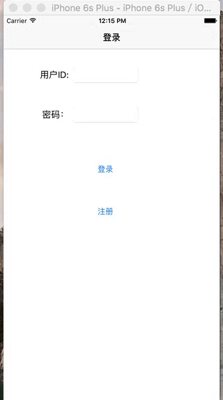

# ModalViewSample

在导航过程中，有时候需要放弃主任务转而做其他次要的任务，然后再返回来主任务，这个“次要的任务”就是在“模态视图”中完成的.本示例也就是模态视图的一个应用例子，在登录界面中，如果用户尚未注册，就要先去注册，当用户注册完成后，他会关闭注册视图，重新回到登录界面继续进行主任务，基于语言Swift2.2，环境XCode7.3.1
（默认情况下，模态视图是从屏幕下方滑出来的。当完成的时候需要关闭这个模态视图，如果不关闭，就不能做别的事情，这就是“模态”的含义，它具有必须响应处理的意思）

运行布局界面如下：



### 主要知识点：
* 呈现模态视图的方法：presentViewController:animated:completion 或直接通过Interface Builder在故事面板的Segue中实现，即present modally;
* 关闭模态视图的方法：dismissViewController:animated:completion;
* 注册完在登录界面直接返回用户，在视图中进行参数的传递使用iOS通知机制，核心代码如下：

1、在登录界面的ViewController中注册通知接收者
```swift
    NSNotificationCenter.defaultCenter().addObserver(self, selector: #selector(ViewController.registerCompletion(_:)), name: "RegisterCompletionNotification", object: nil)
    /**
     回调方法
     */
    func registerCompletion(notification: NSNotification){
        let theData: NSDictionary = notification.userInfo!
        let username = theData.objectForKey("username")
        self.txtUsername.text = username as? String
    }
```
2、在模态视图控制器中投送通知
```swift
    //视图间参数传递
    let dataDict = NSDictionary(object: self.txtUsername.text!, forKey: "username")
    /**
    Notification
    - parameter name: 通知的名字
    - parameter object: 投送通知时传递过来的对象
    - parameter userInfo: 投送通知时定义的字典对象，可借助该参数传递数据
    */
    NSNotificationCenter.defaultCenter().postNotificationName("RegisterCompletionNotification", object: nil, userInfo: dataDict as [NSObject : AnyObject])
```

如果喜欢的话，欢迎**Star**一下
